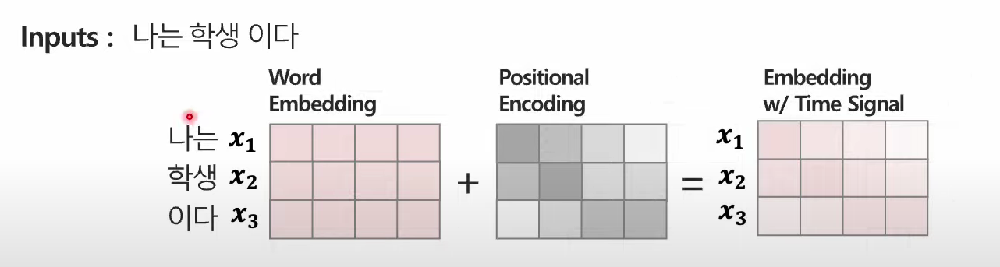
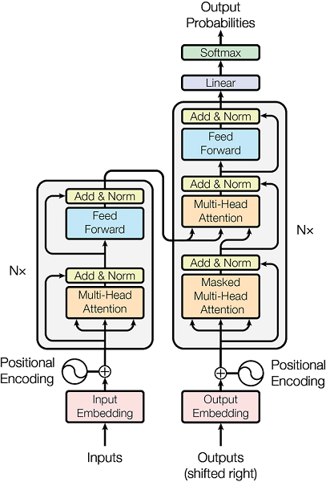
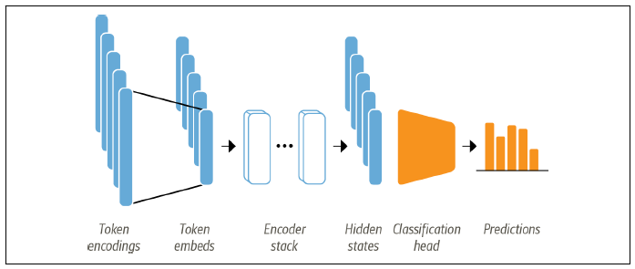

# FINE_TUNE_LLM

## 1. 허깅페이스 소개
모델  
데이터셋  
파이프라인  
도큐먼트 : [https://huggingface.co/docs]  
리더보드 : [https://huggingface.co/spaces/upstage/open-ko-llm-leaderboard]  

## 2. 랭귀지 모델 소개
CausalLM  
SequenceClassification  
TokenClassification  
Summarize  
QuestionAnswering  
Ner  

## 3. 트랜스포머 모델 구성
tokenizer  
```
input = "나는 학교에 간다"
1 = "나는" "학교에" "간다"
2 = "나" "는" "학교" "에" "간다"
3 = [SEP] "나" "는" "학교" "에" "간다" [CLS]
output = 1, 333, 234, 33, 44, 55, 0
```
position_encoding  
  

    시퀀스 위치 ids 임베딩을 input_ids 임베딩과 합침  

인코더/디코더  
  


어텐션 메커니즘 바디 (qkv) + bertviz [참고영상](https://youtu.be/MJYBdTCwxDY?si=Rkhm3G1Ff9ZzjX68)  
분류 헤드  
### *파인튜닝  
pretrained model의 weights를 목적에 맞는 결과를 출력하도록 튜닝하는 것  
0에서 부터 학습하는 경우 데이터양이 많이 필요하고 학습 시간, gpu리소스도 많이 소요됨  
  
-임베딩 튜닝  
-분류기 튜닝  
-임베딩+분류기 튜닝  
-프롬프트 엔지니어링  

    퓨샷/원샷 러닝  
    chain of thought  
    
-프롬프트 튜닝  

    p-tune/ prefix  
    
-adapter 튜닝  

    LoRA/ IA3  

## 4. 학습 코드 구성
tensor 변환  
```python
import torch
torch.Tensor([1,5,768])
```
device 설정  
```python
#숫자는 전부 device 설정을 해야함
import torch
device = torch.device('cuda:0' if torch.cuda.is_available() else 'cpu')
```
model 불러오기  
```python
from transformers import AutoModel, GPTNeoXModel, AutoModelForCausalLM, AutoModelForSequenceClassification
model = AutoModel.pretrained(model_name)
model = GPTNeoXModel.pretrained(model_name)
model = AutoModelForCausalLM.pretrained(model_name)
```
tokenizer 불러오기  

    input_ids : 단어사전 매칭 ids  
    attention_mask : padding 여부  
    token_type_ids : 문장 구분  
    label : 정답  
    
```python
from transformers import AutoTokenizer
tokenizer = AutoTokenizer(model_name)
```
datasets  
```python
from datasets import Dataset
dataset = Dataset.from_pandas(df)
```

|sequence_num|batch2_num|epoch1_num|num1|num2|num3|num4|num5|
|---|---|---|---|---|---|---|---|
|1|1|1|나|는|학교|에|간다|
|2|1|1|학교|종|이|땡|padding|
|3|2|1|어서|모이자|padding|||
|4|2|1|선생님|이|우리를|||
|5|3|1|…|…|…|…|…|
|6|3|1|…|…|…|…|…|
|7|4|1|…|…|…|…|…|
|8|4|1|…|…|…|…|…|
|9|5|1|…|…|…|…|…|
|10|5|1|…|…|…|…|…|

data_loader  
```python
from torch.utils.data import DataLoader
train_dataloader = DataLoader(training_data, batch_size=64, shuffle=True)
test_dataloader = DataLoader(test_data, batch_size=64, shuffle=True)
```
data_collator  
```python
from transformers import DataCollatorWithPadding
data_collator = DataCollatorWithPadding(tokenizer=tokenizer)
```
### *활성함수  

sigmoid  
$$S(x) = \frac {1}{1+e^{-x}}$$

softmax  
$$\sigma = \frac {e^{z_{i}}} {\displaystyle\sum_{j=1}^{k} e^{z_{j}}}$$

### *손실함수  
mse  
$$\mathrm{MSE} = \frac{1}{n} \sum_{i=1}^{n}(Y_{i}-\hat{Y}_{i})^2$$

rmse  
$$\mathrm{RMSD} = \sqrt{\frac{\displaystyle\sum_{i=1}^{N}\left(x_{i}-\hat{x}_{i}\right)^{2}}{N}}$$

cross_entropy  
$$-Y*log(y)-(1-Y)*log(1-y)$$


optimizer  
학습  
weights 저장  
hub 업로드  

## 5. 기본 모델과 데이터셋
klue-로버타 : [https://huggingface.co/klue/roberta-base]  
klue-데이터셋 : [https://huggingface.co/datasets/klue]  

## 6.로버타 전체 코드(keyword+sentiment)
키워드 분류 시행착오  
    CausalLM 모델 사용  
    SequenceClassification 모델 사용  

데이터셋 구축 : 멀티 라벨, 싱글 라벨  
과적합  

## 7. 모델 경량화
quantization  
    부동소수점  
distillation_knowledge, ONNX, 가지치기  
streamlit : [https://docs.streamlit.io/]  
```bash
streamlit run [파일명.py]
```

## 8. 도커, 클라우드 배포
[체크포인트 다운](https://drive.google.com/file/d/1-5zsnJVR_kF0MoQeredj7DTSwSF-1Ikh/view?usp=drive_link)  
  
도커파일 이미지 빌드  
```bash
docker build --tag [이미지명]:[버전]
```
인스턴스 생성 및 도커 구동
```bash
docker run -it --rm [이미지명]:[버전] /bin/bash
```

## *파인튠참고 구름,코알파카 / 기타 W&B
고려대-kullm : [https://github.com/nlpai-lab/KULLM]  
koalpaca : [https://github.com/Beomi/KoAlpaca]  
weights & biases : [https://wandb.ai/home]  
