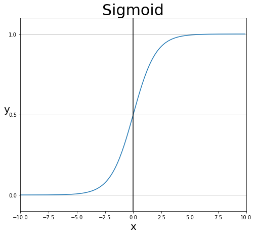
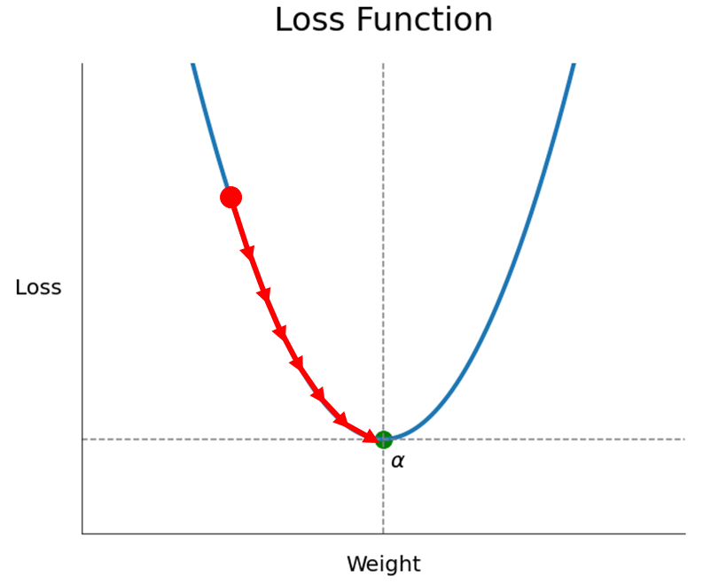
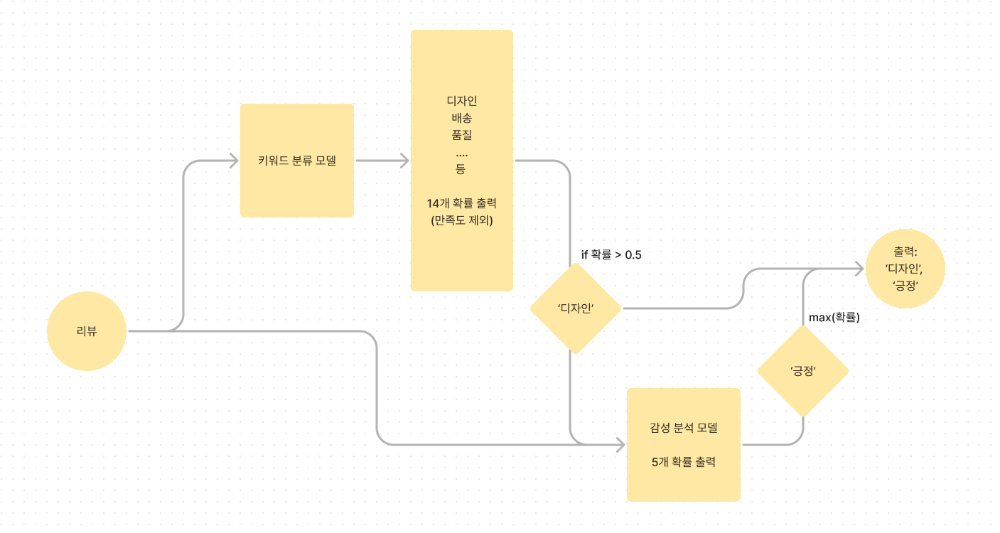
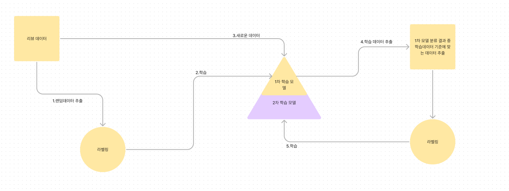
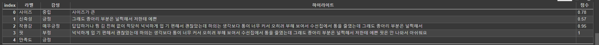

# FINE_TUNE_LM

## 1. 허깅페이스 소개
모델  
데이터셋  
파이프라인  
도큐먼트 : [https://huggingface.co/docs]  
리더보드 : [https://huggingface.co/spaces/upstage/open-ko-llm-leaderboard]  

## 2. 랭귀지 모델 소개
CausalLM  
SequenceClassification  
TokenClassification  
Summarize  
QuestionAnswering  
Ner  

## 3. 트랜스포머 모델 구성
tokenizer  
```
input = "나는 학교에 간다"
1 = "나는" "학교에" "간다"
2 = "나" "는" "학교" "에" "간다"
3 = [SEP] "나" "는" "학교" "에" "간다" [CLS]
output = 1, 333, 234, 33, 44, 55, 0
```
position_encoding  
  

    시퀀스 위치 ids 임베딩을 input_ids 임베딩과 합침  

인코더/디코더  
  


어텐션 메커니즘 바디 (qkv) + bertviz [참고영상](https://youtu.be/MJYBdTCwxDY?si=Rkhm3G1Ff9ZzjX68)  
분류 헤드  
### **파인튜닝**  
> pretrained model의 weights를 목적에 맞는 결과를 출력하도록 튜닝하는 것  
0에서 부터 학습하는 경우 데이터양이 많이 필요하고 학습 시간, gpu리소스도 많이 소요됨  
  
- 임베딩 튜닝  
- 분류기 튜닝  
- 임베딩+분류기 튜닝  
- 프롬프트 엔지니어링  
    - 퓨샷/원샷 러닝  
    - chain of thought  
    
- 프롬프트 튜닝  
    - p-tune/ prefix  
    
- adapter 튜닝  
    - LoRA/ IA3  

## 4. 학습 코드 구성
tensor 변환  
```python
import torch
torch.Tensor([1,5,768])
```
device 설정  
```python
#숫자는 전부 device 설정을 해야함
import torch
device = torch.device('cuda:0' if torch.cuda.is_available() else 'cpu')
```
model 불러오기  
```python
from transformers import AutoModel, GPTNeoXModel, AutoModelForCausalLM, AutoModelForSequenceClassification
model = AutoModel.pretrained(model_name)
model = GPTNeoXModel.pretrained(model_name)
model = AutoModelForCausalLM.pretrained(model_name)
```
tokenizer 불러오기  

    input_ids : 단어사전 매칭 ids  
    attention_mask : padding 여부  
    token_type_ids : 문장 구분  
    label : 정답  
    
```python
from transformers import AutoTokenizer
tokenizer = AutoTokenizer(model_name)
```
datasets  
```python
from datasets import Dataset
dataset = Dataset.from_pandas(df)
```

|sequence_num|batch2_num|epoch1_num|num1|num2|num3|num4|num5|
|---|---|---|---|---|---|---|---|
|1|1|1|나|는|학교|에|간다|
|2|1|1|학교|종|이|땡|padding|
|3|2|1|어서|모이자|padding|||
|4|2|1|선생님|이|우리를|||
|5|3|1|…|…|…|…|…|
|6|3|1|…|…|…|…|…|
|7|4|1|…|…|…|…|…|
|8|4|1|…|…|…|…|…|
|9|5|1|…|…|…|…|…|
|10|5|1|…|…|…|…|…|

data_loader  
```python
from torch.utils.data import DataLoader
train_dataloader = DataLoader(training_data, batch_size=64, shuffle=True)
test_dataloader = DataLoader(test_data, batch_size=64, shuffle=True)
```
data_collator  
```python
from transformers import DataCollatorWithPadding
data_collator = DataCollatorWithPadding(tokenizer=tokenizer)
```
***
### **활성함수**  

> sigmoid  
$$S(x) = \frac {1}{1+e^{-x}}$$

  

> softmax  
$$\sigma = \frac {e^{z_{i}}} {\displaystyle\sum_{j=1}^{k} e^{z_{j}}}$$

### **손실함수**  

> mse  
$$\mathrm{MSE} = \frac{1}{n} \sum_{i=1}^{n}(Y_{i}-\hat{Y}_{i})^2$$

> rmse  
$$\mathrm{RMSD} = \sqrt{\frac{\displaystyle\sum_{i=1}^{N}\left(x_{i}-\hat{x}_{i}\right)^{2}}{N}}$$

> cross_entropy  
$$-Y*log(y)-(1-Y)*log(1-y)$$

  
***

optimizer  
> 손실함수(loss)가 최저가 되는 부분에 도달하도록 W에 손실함수의 순간변화량(미분, 기울기) 만큼 조금씩 뺀다  
$$W-기울기 = W-d(손실함수)$$  



학습  
```python
from transformers import Trainer
trainer = Trainer(
    model=model,
    args=training_args,
    optimizers=(optimizer, lr_scheduler),
    train_dataset=tokenized_datasets["train"],
    eval_dataset=tokenized_datasets["test"],
    tokenizer=tokenizer,
    data_collator=data_collator,
    compute_metrics=compute_metrics,
)

trainer.train()
```
학습 모니터링
```python
from transformers import TrainingArguments
training_args = TrainingArguments(
    output_dir="./bert_test",
    learning_rate= 1e-5, 
    per_device_train_batch_size=64,
    per_device_eval_batch_size=64, 
    num_train_epochs=5,
    optim="adamw_hf",
    weight_decay= 0.5 ,
    evaluation_strategy="epoch",
    save_strategy="epoch",
    load_best_model_at_end=True,
    report_to="wandb",
)
```


모델 저장 
```python
model.save_pretrained(model_output_dir)
```
hub 업로드  
```python
model.push_to_hub("[내계정]/[레포지토리명]", create_pr=1,use_auth_token=True)
```

## 5. 기본 모델과 데이터셋
klue-로버타 : [https://huggingface.co/klue/roberta-base]  
klue-데이터셋 : [https://huggingface.co/datasets/klue]  

## 6.로버타 전체 코드(keyword+sentiment)  

목표 : 리뷰에서 대표 키워드를 뽑아 각 키워드의 sentiment를 구하는 모델을 만드는 것  
Llama를 기점으로 다양한 오픈 소스 모델이 공개되고 있어 llm모델을 활용한 제로샷 러닝으로 모델을 파인 튜닝하는 것을 시도하였으나 생각보다 모델 성능을 높히기 어렵고 단순 다운스트림 테스크에는 roberta 등 소형 모델의 성능이 좀 더 우수하여 roberta를 활용한 모델을 파인튜닝하여 최종 모델을 제작  

### 최종 완성 모델  
키워드 15개와 긍부정 5개로 총 75개의 분류기준이 있어 분류 정확도를 높이기 위해 키워드와 점수 분류를 각각의 별도 모델로 분류  
추론 시에는 키워드 분류 후 분류한 키워드와 리뷰 본문을 모델에 넣어 각각 긍부정 출력  
  


### 모델 파인튠  
- 시행착오(생성형 모델 사용)  
    - CausalLM 모델 사용
Causal 모델은 학습데이터에 target 없이 입력 시퀀스만 입력됨, 그래서 시퀀스에 일부분을 [MASK] 처리 후 해당 부분 예측을 학습  
> [MASK]는 콜레이터로 일괄 생성
```python
from transformers import DataCollatorForLanguageModeling
data_collator=DataCollatorForLanguageModeling(tokenizer, mlm=False)
```
> 학습데이터  

학습 데이터에 타겟은 아래 표와 갚은 형태로 키워드와 긍부정 점수를 같이 입력된 리스트 형태로 생성 후 instruct 문장 형태를 최종 학습 데이터로 사용  
모델이 생성한 정답은 나쁘지 않았으나 하이라이트 추출은 불가함  

|sequence|target|학습데이터|
|---|---|---|
|옷은 예쁘지만 배송은 늦어요|디자인1, 배송-1|###입력: 옷은 예쁘지만 배송은 늦어오 \n ###명령어: 리뷰를 분석해줘 \n###출력: 디자인1, 배송-1|
|색이 정말 이뻐요|색상2|###입력: 색이 정말 이뻐요 \n ###명령어: 리뷰를 분석해줘 \n###출력: 색상2|
|품질이 좀 떨어지지만 가격이 싸니까|품질-1, 가격1|###입력: 품질이 좀 떨어지지만 가격이 싸니까 \n ###명령어: 리뷰를 분석해줘 \n###출력: 품질-1, 가격1|

> **추론**

```python
inputs = tokenizer(
    f'###입력 : \n{리뷰} ###명령어: 리뷰를 분석해줘 \n###출력 :',
    return_tensors="pt",)
```

- 최종 모델(분류 모델 사용)
    - SequenceClassification 모델 사용  
시퀀스 분류 시 target(라벨)이 필요하고 동시에 여러 라벨이 존재하는 멀티라벨 분류와 하나의 라벨로 구성된 싱글라벨 분류로 나뉜다
멀티 라벨 분류로 키워드와 sentiment를 모두 분류할 수 있지만 키워드 15개, sentiment 5개로 총 75개로 분류해야하는데 sentiment의 불균형이 매우 심해 키워드와 sentiment를 각각 분류하는 모델로 결정
하나의 리뷰에 여러개의 키워드가 동시에 존재하므로 멀티라벨로 분류하고, sentiment는 하나의 리뷰 키워드에 하나씩만 결정되므로 싱글라벨로 분류   
***
> 멀티라벨(키워드 분류)

|sequence|배송|가격|디자인|색상|품질|
|---|---|---|---|---|---|
|옷은 예쁘지만 배송은 늦어요|1|0|1|0|0|
|색이 정말 이뻐요|0|0|0|1|0|
|품질이 좀 떨어지지만 가격이 싸니까|1|0|0|0|1|

```python
def __init__(self):
    super(BERTClass, self).__init__()
    self.bert_model = RobertaModel.from_pretrained(model_name_or_path, return_dict=True)
    self.dropout = torch.nn.Dropout(0.2)
    self.linear = torch.nn.Linear(768, 14)
```
> **멀티라벨 학습**  
모델에서 시퀀스 각 키워드의 로짓을 출력하고 각 로짓을 시그모이드 함수에 넣어 최종 예측 확률을 출력한다

|class|sequence|배송|가격|디자인|색상|품질|
|---|---|---|---|---|---|---|
|정답|옷은 예쁘지만 배송은 늦어요|1|0|1|0|0|
|예측|옷은 예쁘지만 배송은 늦어요|0.9|0.03|0.8|0.1|0.01|

> validation data 분류 결과

|class|precision|recall|f1-score|support|
|---|---|---|---|---|
|가격|0.97|0.99|0.98|1,545|
|기능성|0.96|0.98|0.97|1,313|
|길이|0.94|0.96|0.95|430|
|디자인|0.92|0.88|0.9|1,131|
|라인(핏)|0.89|0.89|0.89|1,271|
|마감처리|0.95|0.36|0.53|55|
|배송|0.98|0.98|0.98|364|
|사이즈|0.96|0.97|0.97|2,117|
|색상|0.97|0.97|0.97|1,269|
|소재|0.95|0.95|0.95|2,295|
|스타일|0.83|0.87|0.85|767|
|신축성|0.93|0.93|0.93|256|
|착용감|0.92|0.94|0.93|1,517|
|품질|0.88|0.87|0.88|904|
|micro avg|0.94|0.94|0.94|15,234|
|macro avg|0.93|0.9|0.9|15,234|

***

> 싱글라벨  

|학습데이터|라벨|
|---|---|
|###입력: 옷은 예쁘지만 배송은 늦어오 \n###키워드: 디자인|긍정|
|###입력: 옷은 예쁘지만 배송은 늦어오 \n###키워드: 배송|부정|

> **싱글라벨 학습**  
모델에서 시퀀스의 로짓을 소프트맥스 함수에 넣어 최종 예측 확률을 출력한다

|학습데이터|정답|예측|
|---|---|---|
|###입력: 옷은 예쁘지만 배송은 늦어오 \n###키워드: 디자인|0|0.0|
|###입력: 옷은 예쁘지만 배송은 늦어오 \n###키워드: 디자인|0|0.05|
|###입력: 옷은 예쁘지만 배송은 늦어오 \n###키워드: 디자인|0|0.1|
|###입력: 옷은 예쁘지만 배송은 늦어오 \n###키워드: 디자인|1|0.6|
|###입력: 옷은 예쁘지만 배송은 늦어오 \n###키워드: 디자인|0|0.25|

> validation data 분류 결과

|class|precision|recall|f1-score|support|
|---|---|---|---|---|
|매우부정|0.74|0.59|0.66|361|
|부정|0.78|0.8|0.79|3,641|
|중립|0.69|0.63|0.65|3,583|
|긍정|0.95|0.96|0.96|36,059|
|매우긍정|0.88|0.89|0.88|6,619|
|microavg|0.91|0.91|0.91|50,263|
|macroavg|0.81|0.77|0.79|50,263|

***

모델 구성

- 키워드 분류
- 감성 분석
- 하이라이트 추출
키워드와 sentiment 추출 후 하이라이트 추출  
리뷰에서 한 토큰(띄어쓰기 단위)이 분류에 어느 정도 영향을 끼쳤는지 확인하기 위해 토큰 하나씩 마스킹 하여 전후 분류 확률을 측정하여 전후 차가 가장 큰 경우를 추출  

|키워드|결과|예측확률|제외확률|
|---|---|---|---|
|디자인|[MASK] 예쁘지만 배송은 늦어오|0.9|0.8|
|디자인|옷은 [MASK] 배송은 늦어오|0.9|0.05|
|디자인|옷은 예쁘지만 [MASK] 늦어오|0.9|0.8|
|디자인|옷은 예쁘지만 배송은 [MASK]|0.9|0.7|


## 7. 모델 경량화
quantization  
    부동소수점  
distillation_knowledge, ONNX, 가지치기  
streamlit : [https://docs.streamlit.io/]  
```bash
streamlit run [파일명.py]
```

## 8. 도커, 클라우드 배포
[체크포인트 다운](https://drive.google.com/file/d/1-5zsnJVR_kF0MoQeredj7DTSwSF-1Ikh/view?usp=drive_link)  
깃클론 후 다운받은 체크포인트 파일을 docker폴더에 넣기

  
도커파일 이미지 빌드  
```bash
docker build --tag [이미지명]:[버전]
```
인스턴스 생성 및 도커 구동
```bash
docker run -it --rm [이미지명]:[버전] /bin/bash
```

## 9. 재학습
  
1. 랜덤 데이터 추출 > 라벨링 > 품질 검사  
2. 데이터 학습 > 1차 학습 모델 생성   
3. 새로운 리뷰 데이터 중 몰 or 카테고리 분류에 따른 리뷰 데이터 비례 추출  
4. 1차 모델로 결과 출력 > 새로운 학습 리뷰 데이터 추출 > 라벨링  
5. 데이터 학습  

**새로운 학습 리뷰 데이터를 추출하는 기준**

- 결정경계 주변의 데이터
    - **실제 모델 결과 결정경계**
        txt = "제가 상의 사이즈가 큰편인데 이거는 답답하거나 찡김 전혀 없이 적당히 넉넉하게 입기 편해서 괜찮았는데 하의는 생각보다 통이 너무 커서 오히려 부해 보여서 수선집에서 통을 줄였는데 그래도 종아리 부분은 널쩍해서 저한테 예쁜핏은 안나와서 아쉬워요 그래도 옷 자체가 너무 편하고 상하의 세트인 부분도 마음에 들어요”  
         
    - 키워드 분류 모델
        - 키워드 분류 확률(시그모이드 출력값)이 0.5 주변인 키워드가 있는 경우 추출
    - 감성 분석 모델
        - ~~키워드 분류 확률 분포(소프트맥스 출력값)의 분산이 작은 경우 추출~~
        - (1-max(확률분포))*(label_N/label_N-1)
- 자주 등장하지 않는 데이터
    - sentencepiece 토크나이저를 초기 학습 데이터로 학습 후 토크나이저 출력 input_ids에 <unk>인덱스로 매칭된 토큰 수가 많은 경우 or 늦은 인덱스 토큰이 많은 경우 추출
    - 클러스터링 후 아웃라이어 추출


## *파인튠참고 구름,코알파카 / 기타 W&B
고려대-kullm : [https://github.com/nlpai-lab/KULLM]  
koalpaca : [https://github.com/Beomi/KoAlpaca]  
weights & biases : [https://wandb.ai/home]  
