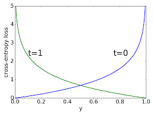

# FINE_TUNE_LM

## 1. 허깅페이스 소개
모델  
데이터셋  
파이프라인  
도큐먼트 : [https://huggingface.co/docs]  
리더보드 : [https://huggingface.co/spaces/upstage/open-ko-llm-leaderboard]  

## 2. 랭귀지 모델 소개
CausalLM  
SequenceClassification  
TokenClassification  
Summarize  
QuestionAnswering  
Ner  

## 3. 트랜스포머 모델 구성
tokenizer  
```
input = "나는 학교에 간다"
1 = "나는" "학교에" "간다"
2 = "나" "는" "학교" "에" "간다"
3 = [SEP] "나" "는" "학교" "에" "간다" [CLS]
output = 1, 333, 234, 33, 44, 55, 0
```
position_encoding  
  

    시퀀스 위치 ids 임베딩을 input_ids 임베딩과 합침  

인코더/디코더  
  


어텐션 메커니즘 바디 (qkv) + bertviz [참고영상](https://youtu.be/MJYBdTCwxDY?si=Rkhm3G1Ff9ZzjX68)  
분류 헤드  
### **파인튜닝**  
> pretrained model의 weights를 목적에 맞는 결과를 출력하도록 튜닝하는 것  
0에서 부터 학습하는 경우 데이터양이 많이 필요하고 학습 시간, gpu리소스도 많이 소요됨  
  
- 임베딩 튜닝  
- 분류기 튜닝  
- 임베딩+분류기 튜닝  
- 프롬프트 엔지니어링  
    - 퓨샷/원샷 러닝  
    - chain of thought  
    
- 프롬프트 튜닝  
    - p-tune/ prefix  
    
- adapter 튜닝  
    - LoRA/ IA3  

## 4. 학습 코드 구성
tensor 변환  
```python
import torch
torch.Tensor([1,5,768])
```
device 설정  
```python
#숫자는 전부 device 설정을 해야함
import torch
device = torch.device('cuda:0' if torch.cuda.is_available() else 'cpu')
```
model 불러오기  
```python
from transformers import AutoModel, GPTNeoXModel, AutoModelForCausalLM, AutoModelForSequenceClassification
model = AutoModel.pretrained(model_name)
model = GPTNeoXModel.pretrained(model_name)
model = AutoModelForCausalLM.pretrained(model_name)
```
tokenizer 불러오기  

    input_ids : 단어사전 매칭 ids  
    attention_mask : padding 여부  
    token_type_ids : 문장 구분  
    label : 정답  
    
```python
from transformers import AutoTokenizer
tokenizer = AutoTokenizer(model_name)
```
datasets  
```python
from datasets import Dataset
dataset = Dataset.from_pandas(df)
```

|sequence_num|batch2_num|epoch1_num|num1|num2|num3|num4|num5|
|---|---|---|---|---|---|---|---|
|1|1|1|나|는|학교|에|간다|
|2|1|1|학교|종|이|땡|padding|
|3|2|1|어서|모이자|padding|||
|4|2|1|선생님|이|우리를|||
|5|3|1|…|…|…|…|…|
|6|3|1|…|…|…|…|…|
|7|4|1|…|…|…|…|…|
|8|4|1|…|…|…|…|…|
|9|5|1|…|…|…|…|…|
|10|5|1|…|…|…|…|…|

data_loader  
```python
from torch.utils.data import DataLoader
train_dataloader = DataLoader(training_data, batch_size=64, shuffle=True)
test_dataloader = DataLoader(test_data, batch_size=64, shuffle=True)
```
data_collator  
```python
from transformers import DataCollatorWithPadding
data_collator = DataCollatorWithPadding(tokenizer=tokenizer)
```
***
### **활성함수**  

> sigmoid  
$$S(x) = \frac {1}{1+e^{-x}}$$

  

> softmax  
$$\sigma = \frac {e^{z_{i}}} {\displaystyle\sum_{j=1}^{k} e^{z_{j}}}$$

### **손실함수**  

> mse  
$$\mathrm{MSE} = \frac{1}{n} \sum_{i=1}^{n}(Y_{i}-\hat{Y}_{i})^2$$

> rmse  
$$\mathrm{RMSD} = \sqrt{\frac{\displaystyle\sum_{i=1}^{N}\left(x_{i}-\hat{x}_{i}\right)^{2}}{N}}$$

> cross_entropy  
$$-Y*log(y)-(1-Y)*log(1-y)$$

  
***

optimizer  
> 손실함수(loss)가 최저가 되는 부분에 도달하도록 W에 손실함수의 순간변화량(미분, 기울기) 만큼 조금씩 뺀다  
$$W-기울기 = W-d(손실함수)$$  


학습  
```python
from transformers import Trainer
trainer = Trainer(
    model=model,
    args=training_args,
    optimizers=(optimizer, lr_scheduler),
    train_dataset=tokenized_datasets["train"],
    eval_dataset=tokenized_datasets["test"],
    tokenizer=tokenizer,
    data_collator=data_collator,
    compute_metrics=compute_metrics,
)

trainer.train()
```
학습 모니터링
```python
from transformers import TrainingArguments
training_args = TrainingArguments(
    output_dir="./bert_test",
    learning_rate= 1e-5, 
    per_device_train_batch_size=64,
    per_device_eval_batch_size=64, 
    num_train_epochs=5,
    optim="adamw_hf",
    weight_decay= 0.5 ,
    evaluation_strategy="epoch",
    save_strategy="epoch",
    load_best_model_at_end=True,
    report_to="wandb",
)
```


모델 저장 
```python
model.save_pretrained(model_output_dir)
```
hub 업로드  
```python
model.push_to_hub("[내계정]/[레포지토리명]", create_pr=1,use_auth_token=True)
```

## 5. 기본 모델과 데이터셋
klue-로버타 : [https://huggingface.co/klue/roberta-base]  
klue-데이터셋 : [https://huggingface.co/datasets/klue]  

## 6.로버타 전체 코드(keyword+sentiment)  

목표 : 리뷰에서 대표 키워드를 뽑아 각 키워드의 sentiment를 구하는 모델을 만드는 것  
Llama를 기점으로 다양한 오픈 소스 모델이 공개되고 있어 llm모델을 활용한 제로샷 러닝으로 모델을 파인 튜닝하는 것을 시도하였으나 생각보다 모델 성능을 높히기 어렵고 단순 다운스트림 테스크에는 roberta 등 소형 모델의 성능이 좀 더 우수하여 roberta를 활용한 모델을 파인튜닝하여 최종 모델을 제작  

### 최종 완성 모델  
키워드 15개와 긍부정 5개로 총 75개의 분류기준이 있어 분류 정확도를 높이기 위해 키워드와 점수 분류를 각각의 별도 모델로 분류  
추론 시에는 키워드 분류 후 분류한 키워드와 리뷰 본문을 모델에 넣어 각각 긍부정 출력  
  


### 모델 파인튠  
- 시행착오(생성형 모델 사용)  
    - CausalLM 모델 사용
Causal 모델은 학습데이터에 target 없이 입력 시퀀스만 입력됨, 그래서 시퀀스에 일부분을 [MASK] 처리 후 해당 부분 예측을 학습  
> [MASK]는 콜레이터로 일괄 생성
```python
from transformers import DataCollatorForLanguageModeling
data_collator=DataCollatorForLanguageModeling(tokenizer, mlm=False)
```
> 학습데이터  

학습 데이터에 타겟은 아래 표와 갚은 형태로 키워드와 긍부정 점수를 같이 입력된 리스트 형태로 생성 후 instruct 문장 형태를 최종 학습 데이터로 사용  
모델이 생성한 정답은 나쁘지 않았으나 하이라이트 추출은 불가함  

|sequence|target|학습데이터|
|---|---|---|
|옷은 예쁘지만 배송은 늦어요|디자인1, 배송-1|###입력: 옷은 예쁘지만 배송은 늦어오 \n ###명령어: 리뷰를 분석해줘 \n###출력: 디자인1, 배송-1|
|색이 정말 이뻐요|색상2|###입력: 색이 정말 이뻐요 \n ###명령어: 리뷰를 분석해줘 \n###출력: 색상2|
|품질이 좀 떨어지지만 가격이 싸니까|품질-1, 가격1|###입력: 품질이 좀 떨어지지만 가격이 싸니까 \n ###명령어: 리뷰를 분석해줘 \n###출력: 품질-1, 가격1|

> **추론**

```python
inputs = tokenizer(
    f'###입력 : \n{리뷰} ###명령어: 리뷰를 분석해줘 \n###출력 :',
    return_tensors="pt",)
```

- 최종 모델(분류 모델 사용)
    - SequenceClassification 모델 사용  
시퀀스 분류 시 target(라벨)이 필요하고 동시에 여러 라벨이 존재하는 멀티라벨 분류와 하나의 라벨로 구성된 싱글라벨 분류로 나뉜다
멀티 라벨 분류로 키워드와 sentiment를 모두 분류할 수 있지만 키워드 15개, sentiment 5개로 총 75개로 분류해야하는데 sentiment의 불균형이 매우 심해 키워드와 sentiment를 각각 분류하는 모델로 결정
하나의 리뷰에 여러개의 키워드가 동시에 존재하므로 멀티라벨로 분류하고, sentiment는 하나의 리뷰 키워드에 하나씩만 결정되므로 싱글라벨로 분류   
***
> 멀티라벨(키워드 분류)

|sequence|배송|가격|디자인|색상|품질|
|---|---|---|---|---|---|
|옷은 예쁘지만 배송은 늦어요|1|0|1|0|0|
|색이 정말 이뻐요|0|0|0|1|0|
|품질이 좀 떨어지지만 가격이 싸니까|1|0|0|0|1|

```python
def __init__(self):
    super(BERTClass, self).__init__()
    self.bert_model = RobertaModel.from_pretrained(model_name_or_path, return_dict=True)
    self.dropout = torch.nn.Dropout(0.2)
    self.linear = torch.nn.Linear(768, 14)
```
> **멀티라벨 학습**  
모델에서 시퀀스 각 키워드의 로짓을 출력하고 각 로짓을 시그모이드 함수에 넣어 최종 예측 확률을 출력한다

|class|sequence|배송|가격|디자인|색상|품질|
|---|---|---|---|---|---|---|
|정답|옷은 예쁘지만 배송은 늦어요|1|0|1|0|0|
|예측|옷은 예쁘지만 배송은 늦어요|0.9|0.03|0.8|0.1|0.01|

> validation data 분류 결과

|class|precision|recall|f1-score|support|
|---|---|---|---|---|
|가격|0.97|0.99|0.98|1,545|
|기능성|0.96|0.98|0.97|1,313|
|길이|0.94|0.96|0.95|430|
|디자인|0.92|0.88|0.9|1,131|
|라인(핏)|0.89|0.89|0.89|1,271|
|마감처리|0.95|0.36|0.53|55|
|배송|0.98|0.98|0.98|364|
|사이즈|0.96|0.97|0.97|2,117|
|색상|0.97|0.97|0.97|1,269|
|소재|0.95|0.95|0.95|2,295|
|스타일|0.83|0.87|0.85|767|
|신축성|0.93|0.93|0.93|256|
|착용감|0.92|0.94|0.93|1,517|
|품질|0.88|0.87|0.88|904|
|micro avg|0.94|0.94|0.94|15,234|
|macro avg|0.93|0.9|0.9|15,234|

***

> 싱글라벨  

|학습데이터|라벨|
|---|---|
|###입력: 옷은 예쁘지만 배송은 늦어오 \n###키워드: 디자인|긍정|
|###입력: 옷은 예쁘지만 배송은 늦어오 \n###키워드: 배송|부정|

> **싱글라벨 학습**  
모델에서 시퀀스의 로짓을 소프트맥스 함수에 넣어 최종 예측 확률을 출력한다

|학습데이터|정답|예측|
|---|---|---|
|###입력: 옷은 예쁘지만 배송은 늦어오 \n###키워드: 디자인|0|0.0|
|###입력: 옷은 예쁘지만 배송은 늦어오 \n###키워드: 디자인|0|0.05|
|###입력: 옷은 예쁘지만 배송은 늦어오 \n###키워드: 디자인|0|0.1|
|###입력: 옷은 예쁘지만 배송은 늦어오 \n###키워드: 디자인|1|0.6|
|###입력: 옷은 예쁘지만 배송은 늦어오 \n###키워드: 디자인|0|0.25|

> validation data 분류 결과

|class|precision|recall|f1-score|support|
|---|---|---|---|---|
|매우부정|0.74|0.59|0.66|361|
|부정|0.78|0.8|0.79|3,641|
|중립|0.69|0.63|0.65|3,583|
|긍정|0.95|0.96|0.96|36,059|
|매우긍정|0.88|0.89|0.88|6,619|
|microavg|0.91|0.91|0.91|50,263|
|macroavg|0.81|0.77|0.79|50,263|

***

모델 구성

- 키워드 분류
- 감성 분석
- 하이라이트 추출
키워드와 sentiment 추출 후 하이라이트 추출  
리뷰에서 한 토큰(띄어쓰기 단위)이 분류에 어느 정도 영향을 끼쳤는지 확인하기 위해 토큰 하나씩 마스킹 하여 전후 분류 확률을 측정하여 전후 차가 가장 큰 경우를 추출  

|키워드|결과|예측확률|제외확률|
|---|---|---|---|
|디자인|[MASK] 예쁘지만 배송은 늦어오|0.9|0.8|
|디자인|옷은 [MASK] 배송은 늦어오|0.9|0.05|
|디자인|옷은 예쁘지만 [MASK] 늦어오|0.9|0.8|
|디자인|옷은 예쁘지만 배송은 [MASK]|0.9|0.7|


## 7. 모델 경량화
quantization  
    부동소수점  
distillation_knowledge, ONNX, 가지치기  
streamlit : [https://docs.streamlit.io/]  
```bash
streamlit run [파일명.py]
```

## 8. 도커, 클라우드 배포
[체크포인트 다운](https://drive.google.com/file/d/1-5zsnJVR_kF0MoQeredj7DTSwSF-1Ikh/view?usp=drive_link)  
깃클론 후 다운받은 체크포인트 파일을 docker폴더에 넣기

  
도커파일 이미지 빌드  
```bash
docker build --tag [이미지명]:[버전]
```
인스턴스 생성 및 도커 구동
```bash
docker run -it --rm [이미지명]:[버전] /bin/bash
```

## 9. 재학습
  
1. 랜덤 데이터 추출 > 라벨링 > 품질 검사  
2. 데이터 학습 > 1차 학습 모델 생성   
3. 새로운 리뷰 데이터 중 몰 or 카테고리 분류에 따른 리뷰 데이터 비례 추출  
4. 1차 모델로 결과 출력 > 새로운 학습 리뷰 데이터 추출 > 라벨링  
5. 데이터 학습  

**새로운 학습 리뷰 데이터를 추출하는 기준**

- 결정경계 주변의 데이터
    - **실제 모델 결과 결정경계**
        txt = "제가 상의 사이즈가 큰편인데 이거는 답답하거나 찡김 전혀 없이 적당히 넉넉하게 입기 편해서 괜찮았는데 하의는 생각보다 통이 너무 커서 오히려 부해 보여서 수선집에서 통을 줄였는데 그래도 종아리 부분은 널쩍해서 저한테 예쁜핏은 안나와서 아쉬워요 그래도 옷 자체가 너무 편하고 상하의 세트인 부분도 마음에 들어요”  
         
    - 키워드 분류 모델
        - 키워드 분류 확률(시그모이드 출력값)이 0.5 주변인 키워드가 있는 경우 추출
    - 감성 분석 모델
        - ~~키워드 분류 확률 분포(소프트맥스 출력값)의 분산이 작은 경우 추출~~
        - (1-max(확률분포))*(label_N/label_N-1)
- 자주 등장하지 않는 데이터
    - sentencepiece 토크나이저를 초기 학습 데이터로 학습 후 토크나이저 출력 input_ids에 <unk>인덱스로 매칭된 토큰 수가 많은 경우 or 늦은 인덱스 토큰이 많은 경우 추출
    - 클러스터링 후 아웃라이어 추출


### **패션데이터셋 라벨 오류 확인**

- 첫 패션 데이터 모델 학습 후  300개 테스트 데이터를 추론 결과
    - 신축성이 지나치게 눈에 띔을 확인(300개 중 160개 리뷰에서 확인됨)
    - 테스트 정확도 체크 이전에 학습 데이터 확인 진행

- 학습 데이터 신축성 오류 리뷰
    
    
    | Text | Completion |
    | --- | --- |
    | 딱좋아요 치마위에 입으니 예뻐요 | 스타일 1, 만족도 2, 신축성 2 |
    | 모델분입은그대로샀어요스커트와잘서울여요 | 만족도 1, 배송 1, 신축성 1 |
    | 앏고 편해요~ 요즘 딱 입기 좋습니다! | 착용감 1, 만족도 1, 신축성 1, 품질 1 |
    | 그냥그럭저럭ㅋ 아직입어보진않았지만 갠춘 | 만족도 0, 신축성 1 |
    | 라인도색상도너무예뻐요득템!기분좋아지는옷이에요 | 만족도 2, 색상 2, 소재 1, 핏 2, 신축성 1 |
    | 귀여워요소매부분도 많이 내려오고핏도 예쁜 티내요! | 디자인 1, 만족도 1, 핏 1, 신축성 1, 길이 1 |
    | 무난하게 입기 딱 좋은 스탈이네요~ 핑크도 사고싶네요 | 스타일 1, 만족도 2, 신축성 1 |
    | 뱃살이 살짝 부각되지만 차르르 흘러내리는 게 예뻐요ㅎㅎ | 만족도 1, 핏 0, 착용감 1, 신축성 1 |
    | 앏고 편하고 넘 좋습니다. 요즘같은 날씨 입기 딱이에요~ | 착용감 1, 만족도 2, 신축성 1, 품질 1 |
    | 핑크 사고 만족스러워서 재구매했습니다~ 적당히 빳빳하고 넉넉해요 | 만족도 2, 핏 1, 신축성 1, 품질 1 |
    | 상품명 그대로 치즈처럼 쫀득하면서슬림한 티셔츠네요 기본으로 입기좋아요 | 착용감 1, 스타일 1, 만족도 1, 핏 1, 소재 1, 신축성 1 |
    | 뒤가 좀 짧은편이고 아주 잘 흘러내리지만 입었을때 라인이 이뻐서 좋네요 | 신축성 1, 길이 0, 착용감 0, 핏 1, 만족도 1 |
    | 밴딩 스커트 두게감도 있고 지금 입어도 좋을것 같아요~ 봄에도 잘 입겠어요 | 착용감 1, 만족도 1, 신축성 1, 길이 1 |
    | 찰랑거리고 시원한 재질이에요.허리 밴드가 짱찡히지만 복부가 답답히진 않아요. | 기능성 1, 착용감 1, 만족도 1, 소재 1, 신축성 1 |
    | 작년에 검정색 샀었는데 괜찮아서 베이지도 구매했어요. 가본 스탈이예요 잘입을께요 | 만족도 1, 신축성 1 |
    | 검은색 민소매 원피스와 너무 잘어울려요~약간 흘러내리는 느낌이라 여리여리해 보이네요 | 스타일 2, 만족도 2, 착용감 1, 신축성 1 |
    | 컬러별로 다 구매했어요 옷은이쁜데 건조기돌렸더니 넘작아져서 아이줬어요 너무아깝 ㅠㅠ | 품질 -2, 신축성 -2, 디자인 1, 길이 -2, 만족도 -2 |
    | 역시 왜 인기 많고 ~ 잘나가는지 알겠어요카라부분도 빳빳하고 너무이쁨 소매부분도 넓어서 이뻐요 | 디자인 2, 만족도 2, 신축성 1, 품질 1 |
    | 슈가 폭스 니트 오트밀크림 컬러 마음에 들어요!~폭신폭신 부드럽고 따뜻한듯~같이 구매한 울자켓과 찰떡 짝꿍이에요!~ | 스타일 2, 만족도 2, 색상 1, 착용감 1, 기능성 1, 신축성 1 |
    | 슈가 폭스 니트 라이트그레이 컬러 마음에 들어요!~폭신폭신 부드럽고 따뜻한듯~같이 구매한 울자켓과 찰떡 짝꿍이에요!~ | 스타일 2, 만족도 2, 색상 1, 착용감 1, 기능성 1, 신축성 1 |
    | 깔끔하고 차르르 떨어지는 느낌이들어 샀어요 핏도 길이도 맘에드는데 허리 밑 부분이 타잇해서 늘리려고 수선맡겼어요L만들어주세요 | 착용감 1, 만족도 1, 핏 1, 길이 1, 디자인 1, 신축성 -1 |
    | M 추천해줘서 사긴샀는데..배가 좀 쪼이긴해요..근데 바지가 넘 제 스퇄이에요..조금 긴듯한 느낌이 있긴한데 줄이긴 좀 애매한듯요 | 만족도 -1, 착용감 -1, 길이 -1, 신축성 -1 |
    | 저는 화면에서 보이듯 일반 면재질의 셔츠인줄 알았는데톡톡한 거즈느낌의셔츠더라구요세탁후 위아래가 수축되어서 양손으로 잡고 펴줘야하네요ㅜㅠ | 착용감 -1, 소재 1, 만족도 0, 핏 -1, 신축성 -1, 품질 -1 |
    | 나시가 보통 끈이 흘러내려서 넘 번거로운데 이거는 끈이 안흘러내려서 좋아요! 칼라도 무난해서 검정바지나 아이보리색 바지에도 다 어울려요! | 스타일 1, 만족도 1, 색상 1, 착용감 1, 신축성 1 |
    | 허리가 배바지처럼 높이 올라와서 편하지만 조금 이상하기도 해요 겉옷을 빼고 가려야해요. 제가 허리가 너무 없는건지 엉덩이는 꽉 끼고 허리가 좀 널러뢔요 | 착용감 1, 만족도 -1, 핏 -1, 디자인 1, 신축성 0, 품질 -1 |
    | 처음입었을때 너무 짧아서 놀랐어용하지만 전 키가 작아서 맘에 드네요 ㅋㅋㅋ 원단도 시원하고 목파짐도 좋고 검정색도 하나더 살려구용 ~ ^^ | 기능성 1, 만족도 1, 소재 1, 신축성 1, 길이 -1 |

    | keyword | support | 오류 | 오류 비중 |
    | --- | --- | --- | --- |
    | 만족도 | 3,000 |  |  |
    | 배송 | 1,319 |  |  |
    | 사이즈 | 354 |  |  |
    | 스타일 | 676 |  |  |
    | 신축성 | 666 | 26 | 4% |
    | 가격 | 806 |  |  |
    | 길이 | 505 |  |  |
    | 품질 | 525 |  |  |
    | 핏 | 722 |  |  |
    | 기능성 | 291 |  |  |
    | 색상 | 766 |  |  |
    | 마감처리 | 333 |  |  |
    | 소재 | 969 |  |  |
    | 착용감 | 928 |  |  |
    | 디자인 | 1,141 |  |  |

**신축성 오류 데이터만 제거 후 재학습 진행**

기존에는 3,000개 중 80% 데이터만으로 학습을 진행해서 이번에는 validation 데이터는 생성하지 않고 3,000개 데이터 모두 학습데이터로 활용(학습 파라이터는 기존과 동일하게 진행, 기존 키워드 분류 모델 학습시에는 40에폭에도 과적합이 없었으나 감성분석모델에서는 과적합으로 에폭을 10회 진행)

테스트 데이터의 라벨은 올거나이즈 결과로 함

**신축성 데이터 제거 후 재학습 결과**

| label | precision | recall | f1-score | support(test) | train | test/train |
| --- | --- | --- | --- | --- | --- | --- |
| 가격 | 0.78 | 0.97 | 0.86 | 29 | 806 | 4% |
| 기능성 | 1 | 0.92 | 0.96 | 24 | 291 | 8% |
| 길이 | 0.89 | 0.89 | 0.89 | 57 | 505 | 11% |
| 디자인 | 0.88 | 0.86 | 0.87 | 121 | 1141 | 11% |
| 마감처리 | 0.1 | 0.67 | 0.17 | 3 | 333 | 1% |
| 만족도 | 1 | 1 | 1 | 300 | 3000 | 10% |
| 배송 | 0.78 | 1 | 0.88 | 21 | 1319 | 2% |
| 사이즈 | 0.92 | 0.7 | 0.8 | 103 | 354 | 29% |
| 색상 | 0.93 | 0.95 | 0.94 | 79 | 766 | 10% |
| 소재 | 0.88 | 0.9 | 0.89 | 94 | 969 | 10% |
| 스타일 | 0.87 | 0.75 | 0.8 | 96 | 676 | 14% |
| 신축성 | 0.14 | 1 | 0.25 | 13 | 640 | 2% |
| 착용감 | 0.95 | 0.85 | 0.9 | 116 | 928 | 13% |
| 품질 | 0.59 | 0.71 | 0.65 | 28 | 525 | 5% |
| 핏 | 0.92 | 0.75 | 0.82 | 116 | 722 | 16% |
| micro avg | 0.85 | 0.88 | 0.86 | 1,200 |  |  |
| macro avg | 0.77 | 0.86 | 0.78 | 1,200 |  |  |

신축성이 있는 리뷰 13개는 모두 맞췄으나 신축성과 관련 없는 리뷰를 신축성으로 분류함(91개)

신축성과 관련이 있는 사이즈는 103개 중 70개 정도만 사이즈로 분류하고 나머지는 다른 것으로 분류함 > 학습 데이터도 354개로 적은 편

- 학습 데이터 사이즈 오류 리뷰
    
    
    | id | review | Completion |
    | --- | --- | --- |
    | 176 | 면이라 신축성은 없네요~ 허리가 타이트하네요 | 만족도 -1, 소재 -1, 사이즈 -1, 신축성 -1 |
    | 433 | 1+1으로 저렴하게 구입했고 크림색 티셔츠도 색감 이뻐요 | 만족도 1, 색상 1, 사이즈 1, 가격 1 |
    | 616 | 잘받았어요엄청 빨리 받았어요깔끔한 아이보리색상에 낙낙하고 편해요 | 착용감 1, 만족도 1, 배송 2, 핏 1, 색상 1, 사이즈 1 |
    | 1297 | 12일걸려서 받았네여 역대급인듯 아무튼 재질은 즈응말 부드럽고 좋아용 계속 쓰다듬고 싶네용 | 착용감 1, 만족도 1, 배송 -1, 소재 1, 사이즈 1 |
    | 1325 | 정말 스판끼는 없지만입다보면 그래도 늘어날 것 같아요색도 이쁘고 편하고 다리길이도 딱 맞아요 | 색상 1, 만족도 1, 착용감 1, 핏 1, 길이 1, 신축성 -1, 사이즈 1 |
    | 1881 | 옷이 가볍고 신축성이 있어서 입었을 때 기분이 좋아요~사이사이에 구멍이 약간 큰 게 있지만 올만 안 풀리면 상관없어요~ | 착용감 1, 만족도 1, 소재 1, 사이즈 0, 신축성 1, 품질 -1 |
    | 1888 | 기장이좀작다는게 아쉽지 너무 귀여워요비침정도야 어쩔수없는 여름블라우스니뭐...너무오래기다린상품이예요150.40키로 입니다 | 길이 -1, 사이즈 0, 소재 0, 배송 -2, 만족도 0, 디자인 2 |
    | 2411 | 허리스판끼가 하나도없어서 m으로 교환해야할듯요근데 색이 베이지라기보다 그레이 카키 섞인 느낌이네요 완전 베이지였음좋았을텐데ㅠ 사진이랑 느낌이 너무 달른거같아요 | 만족도 -1, 색상 -1, 사이즈 -1, 신축성 -1 |
    | 2423 | 기모있는바지라고해서 구매했는데 엄청 적게들어간거라고하더라구요 그래서 좋기도해요 기모 많이들어간바지 불편해서 손이 안가는데 괜찮네요:)스판기는 없어서 쪼꼼아쉽네용 | 착용감 1, 만족도 0, 소재 1, 사이즈 1, 신축성 -1 |
    | 2637 | 키 154/ 몸무게 45kg 인데 스판끼가 하나도 없고 저도 마른편인게 완전 허리가 꽉 끼네요… 키 160에 제 몸무게 정도 되시는 분들은 그나마 입을만 할거 같아요 ㅜㅜ 바꾸기 애매하네요 | 만족도 -1, 핏 -2, 사이즈 -2, 신축성 -1 |
    | 2855 | 여름철 원단으로 얇고 시원할듯아주 마른 44인데 티 안넣고 입음 모델컷처럼 매끈하지만티넣고 입음 안쪽 옷 맵시 정리가 조금 난감해서한 치수 큰거로 바꿔야 하나 그냥 입어야 하나 고민 중디자인이나 색상 모두 만족함이번에는 배송도 무지 빨랐음 | 기능성 1, 디자인 1, 착용감 1, 만족도 1, 배송 2, 소재 1, 색상 1, 사이즈 -1, 마감처리 -1 |
    | 2872 | 출산한지 120일정도 됬는데 역시 아직은 타이트 하네요 ㅋㅋ 다른 바지는 잘 들어가는데 이 바지는 허리가 좀 낑겨요ㅠㅠ 잠기기는 하는데 좀 입어서 늘려야할 것 같아요 ㅋㅋ그래도 색이랑 옷 자체는 넘 예뻐요~~ 신축성은 별로 없으니 참고하세염 | 만족도 1, 색상 2, 핏 -1, 착용감 -1, 디자인 2, 사이즈 -1, 신축성 -1 |
    | 2916 | 예뻐용!! 아우터랑 입을려고 샀는데 딱 맞네오 ! 길이도 7부라서 초여름까지는 입을 수 있을거같아요:) 단독으로도 입기 좋고 저켓이랑 입어도 좋고 여러방법으로 입을 수 있어서 좋네염!! 무엇보다 가격이 착해서 더 좋은거같아요 키키킼 다음에 또 구매할거같아여 | 길이 1, 만족도 1, 디자인 1, 사이즈 1, 스타일 1, 가격 2 |
    | 2951 | 기대보다 더 괜찮아요.질이좋고, 디테일도 섬세하구요.삼만원정도에 딱 맞는듯.얇아서 덥지도않고 펀칭도 브래지어 윗부분 끝이랑 연결된 분이 보이긴하는데, 흰 속옷입고 입을려구요.기장은앞이좀 짧아요. 플레어로퍼지는 옷이구, 가슴은 안파엿어요. 일요일에시켯는데, 화요일에 바로왓음. | 디자인 1, 만족도 1, 배송 1, 소재 1, 사이즈 2, 가격 1, 품질 1, 길이 -1 |

| keyword | 개수 | count | perc |
| --- | --- | --- | --- |
| 사이즈 | 354 | 14 | 4% |
| 신축성 | 666 | 26 | 4% |

**신축성+사이즈 오류 데이터 제거 후 재학습 진행**

키워드 분류 모델

| label | precision | recall | f1-score | support |
| --- | --- | --- | --- | --- |
| 가격 | 0.81 | 1 | 0.89 | 29 |
| 기능성 | 1 | 0.96 | 0.98 | 24 |
| 길이 | 0.9 | 0.93 | 0.91 | 57 |
| 디자인 | 0.92 | 0.82 | 0.86 | 121 |
| 마감처리 | 0.17 | 0.67 | 0.27 | 3 |
| 배송 | 0.75 | 1 | 0.86 | 21 |
| 사이즈 | 0.97 | 0.74 | 0.84 | 103 |
| 색상 | 0.95 | 0.95 | 0.95 | 79 |
| 소재 | 0.93 | 0.89 | 0.91 | 94 |
| 스타일 | 0.93 | 0.67 | 0.78 | 96 |
| 신축성 | 0.21 | 1 | 0.35 | 13 |
| 착용감 | 0.94 | 0.87 | 0.9 | 116 |
| 품질 | 0.62 | 0.64 | 0.63 | 28 |
| 핏 | 0.91 | 0.74 | 0.82 | 116 |
| micro | 0.85 | 0.83 | 0.84 | 900 |
| macro | 0.79 | 0.85 | 0.78 | 900 |

감성모델(키워드를 맞춘 데이터 한정)

| label | precision | recall | f1-score | support |
| --- | --- | --- | --- | --- |
| 완전부정 | 0.75 | 0.67 | 0.71 | 18 |
| 부정 | 0.69 | 0.83 | 0.75 | 76 |
| 중립 | 0.5 | 0.48 | 0.49 | 64 |
| 긍정 | 0.93 | 0.92 | 0.93 | 248 |
| 완전긍정 | 0.96 | 0.84 | 0.9 | 153 |
| micro avg | 0.84 | 0.83 | 0.84 | 559 |
| macro avg | 0.77 | 0.75 | 0.75 | 559 |


### 결과

**신축성, 사이즈, 마감처리, 품질 데이터 오류 및 분류기준이 애매모호한 경우가 있어 분류기준을 명확히 하여 라벨링을 다시 해야 함**

우선 눈에 띄는 오류만 제거하여 재 학습

최종 수정 후 결과(잘못된 라벨 제거, 라벨 미출력 리뷰도 제거)

| label | precision | recall | f1-score | support |
| --- | --- | --- | --- | --- |
| 가격 | 0.83 | 1 | 0.91 | 29 |
| 기능성 | 1 | 0.92 | 0.96 | 24 |
| 길이 | 0.89 | 0.88 | 0.88 | 57 |
| 디자인 | 0.9 | 0.82 | 0.86 | 121 |
| 마감처리 | 0.5 | 0.67 | 0.57 | 3 |
| 배송 | 0.72 | 1 | 0.84 | 21 |
| 사이즈 | 0.95 | 0.71 | 0.81 | 101 |
| 색상 | 0.95 | 0.91 | 0.93 | 79 |
| 소재 | 0.94 | 0.88 | 0.91 | 94 |
| 스타일 | 0.88 | 0.66 | 0.75 | 96 |
| 신축성 | 0.25 | 1 | 0.39 | 13 |
| 착용감 | 0.96 | 0.9 | 0.93 | 116 |
| 품질 | 0.53 | 0.68 | 0.59 | 28 |
| 핏 | 0.92 | 0.77 | 0.83 | 115 |
| micro | 0.86 | 0.82 | 0.84 | 897 |
| macro | 0.8 | 0.84 | 0.8 | 897 |
| avg | 0.89 | 0.82 | 0.85 | 897 |
| samples | 0.88 | 0.83 | 0.83 | 897 |

마감처리 : 정답 3개 중 2개는 정답을 맞추고, 예측 4개 중 2개는 틀림

사이즈 : 정답 101개 중 70개 정도는 정답을 맞추고, 예측 7x개 중 잘못 예측을 한 리뷰는 5개 미만

신축성 : 정답 13개 중 전체 정답을 맞췄으나 예측 6x개 중 잘못 예측을 한 리뷰는 50개 정도 

품질 : 정답 28개 중 20개 정도는 정답을 맞추고, 예측 4x개 중 절반 정도만 정답을 맞춤

마감처리와 품질, 신축성은 테스트 데이터가 매우 적기 때문에(학습 데이터 외의 내용만 있을 경우) recall이 작을 순 있음

마감처리와 신축성의 precision은  어느 정도 개선이 되었으나 품질 precision은 나빠짐, 신축성 precision이 개선이 안되는 것은 ‘쫀쫀’의 영향이 매우 컸다고 판단하였으나 사이즈나 품질 등 전반적인 확인이 필요해보임

### 기준 재확립(기존 테스트 데이터)

`마감처리`는 품질에 하위에 속하는 개념이라고 할 수 있어 명확한 구분이 필요함

| 구김 | 배송 시 구겨진 경우를 제외하고는 소재로 라벨링 |
| --- | --- |

`품질`

| 늘어난다 | 내구도에 문제가 있어 늘어나는 경우를 제외하고는 신축성으로 라벨링 |
| --- | --- |
| 구김 | 소재나 마감처리 |
| 바느질/박음질/실밥 | 마감처리 |

`신축성`

| 쫀쫀/짱짱 | 품질에 속함, 허리 밴드나 신축성관련 어휘와 함께 사용 시에만 신축성에 속함 |
| --- | --- |

사람이 라벨링을 할 때는 ‘키워드 태깅 기준’을 참고하여 특정 키워드가 보이면, 의미를 확인 후 라벨링

모델은 학습할 때 전체 문장(시퀀스)에서 주변 단어와 빈도수 따라 학습(특정 키워드는 모델이 알아서 집중)

`예시` 옷이 짱짱하고, 디자인이 이뻐요. 세탁 후 보풀은 안생겨요

```jsx
사람은 ‘짱짱’을 보고 품질과 신축성을 라벨링함

모델이 학습할 때는 리뷰에서 품질과 신축성을 출력할 수 있도록 빈도수와 주변단어를 학습
모델이 다른 리뷰에서 예시와 비슷한 구조의 문장이 있는 경우 신축성과 품질을 출력

하지만 모델은 ‘짱짱’이라는 단어를 보고 학습을 하는 것이 아닌 품질과 신축성이 라벨링된 전체 문장들에서 
주변단어들과 등장하는 빈도를 학습하였기 때문에 ‘짱짱’이 아닌 다른 단어를 집중하고 있을 수 있음 
예를 들어 ‘소재’를 집중하여 결과를 출력한 경우 ‘소재’ 단어를 보면 신축성과 품질을 출력할 수도 있다
(소재 관련 학습 데이터 보다 품질, 신축성 학습 데이터가 많은 경우 더욱 뚜렷해질 것)

라벨의 이름은 학습에 영향을 끼치지 않는다. 
모델은 0~1 사이 숫자들만 출력, 숫자의 인덱스에 매칭된 라벨을 확인하는 것
```


## *파인튠참고 구름,코알파카 / 기타 W&B
고려대-kullm : [https://github.com/nlpai-lab/KULLM]  
koalpaca : [https://github.com/Beomi/KoAlpaca]  
weights & biases : [https://wandb.ai/home]  
